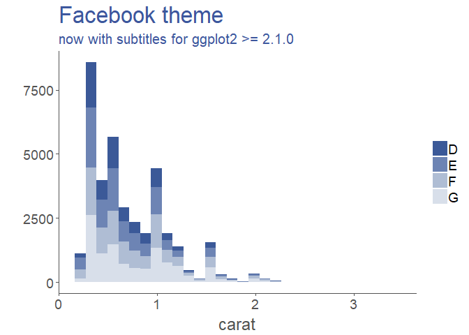
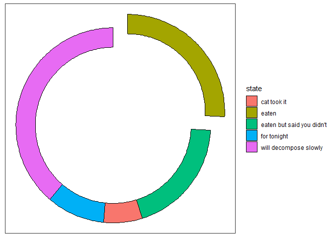
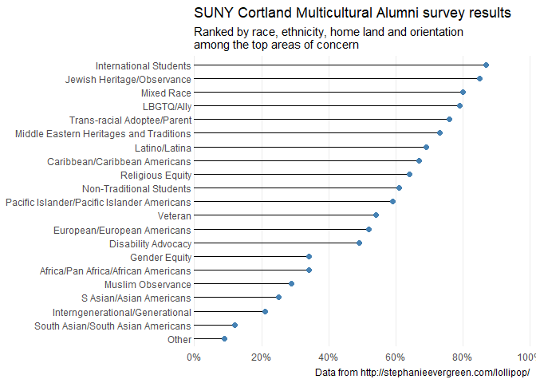
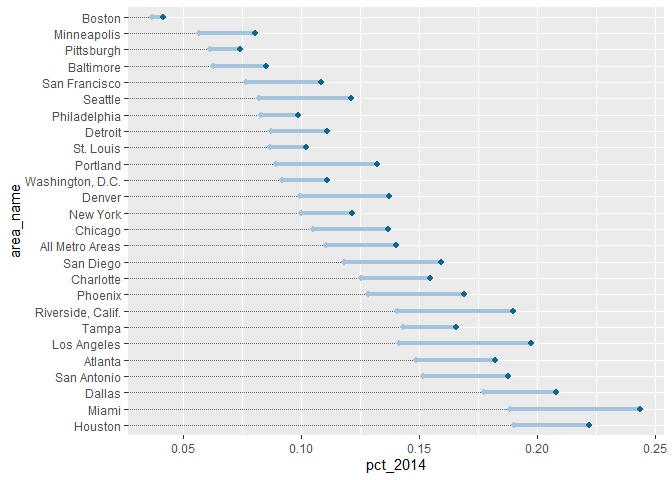
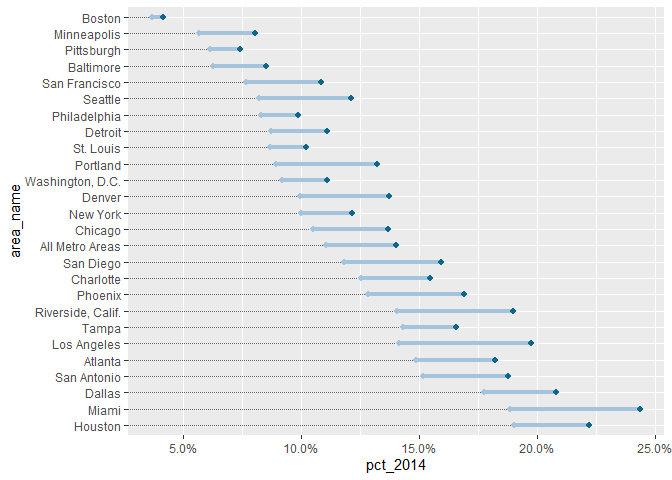

-   [ggtech](#ggtech)
-   [ggQC](#ggqc)
-   [ggalt](#ggalt)
-   [ggiraph](#ggiraph)
-   [ggstance](#ggstance)
-   [ggrepel](#ggrepel)
-   [ggpmisc](#ggpmisc)
-   [ggExtra](#ggextra)
-   [ggsci](#ggsci)
-   [ggalluvial](#ggalluvial)
-   [survminer](#survminer)

ggtech
======

<https://github.com/ricardo-bion/ggtech>

``` r
# install ggtech
devtools::install_github("ricardo-bion/ggtech", dependencies=TRUE)

# Example from https://github.com/ricardo-bion/ggtech
library(ggplot2)
library(ggtech)

# install font from http://social-fonts.com/
library(extrafont)

## Facebook 
download.file("http://social-fonts.com/assets/fonts/facebook-letter-faces/facebook-letter-faces.ttf", "/Library/Fonts/facebook-letter-faces.ttf", method="curl")
font_import(pattern = 'facebook-letter-faces.ttf', prompt=FALSE)

## Google 
download.file("http://social-fonts.com/assets/fonts/product-sans/product-sans.ttf", "/Library/Fonts/product-sans.ttf", method="curl")
font_import(pattern = 'product-sans.ttf', prompt=FALSE)

## Airbnb 
download.file("https://github.com/ricardo-bion/ggtech/blob/master/Circular%20Air-Medium%203.46.45%20PM.ttf", "/Library/Fonts/Circular Air-Medium 3.46.45 PM.ttf", method="curl")
download.file("https://github.com/ricardo-bion/ggtech/blob/master/Circular%20Air-Bold%203.46.45%20PM.ttf", "/Library/Fonts/Circular Air-Bold 3.46.45 PM.ttf", method="curl")
font_import(pattern = 'Circular', prompt=FALSE)

## Etsy 
download.file("https://www.etsy.com/assets/type/Guardian-EgypTT-Text-Regular.ttf", "/Library/Fonts/Guardian-EgypTT-Text-Regular.ttf", method="curl")
font_import(pattern = 'Guardian-EgypTT-Text-Regular.ttf', prompt=FALSE)

## Twitter 
download.file("http://social-fonts.com/assets/fonts/pico-black/pico-black.ttf", "/Library/Fonts/pico-black.ttf", method="curl")
download.file("http://social-fonts.com/assets/fonts/arista-light/arista-light.ttf", "/Library/Fonts/arista-light.ttf", method="curl")
font_import(pattern = 'pico-black.ttf', prompt=FALSE)
font_import(pattern = 'arista-light.ttf', prompt=FALSE)
```

``` r
# use ggtech
library(ggplot2)
library(ggtech)

(d <- qplot(carat, data = diamonds[diamonds$color %in%LETTERS[4:7], ], geom = "histogram", bins=30, fill = color))
```


``` r
# tech themes and scales
#d + theme_tech(theme="airbnb") + 
#  scale_fill_tech(theme="airbnb") + 
#  labs(title="Airbnb theme", 
#       subtitle="now with subtitles for ggplot2 >= 2.1.0")

#d + theme_airbnb_fancy() + 
#  scale_fill_tech(theme="airbnb")  + 
#  labs(title="Airbnb theme", 
#       subtitle="now with subtitles for ggplot2 >= 2.1.0")

d + theme_tech(theme="etsy") + 
  scale_fill_tech(theme="etsy") + 
  labs(title="Etsy theme", 
       subtitle="now with subtitles for ggplot2 >= 2.1.0")
```


``` r
d + theme_tech(theme="facebook") +
  scale_fill_tech(theme="facebook") + 
  labs(title="Facebook theme", 
       subtitle="now with subtitles for ggplot2 >= 2.1.0")
```



``` r
d + theme_tech(theme="google") + 
  scale_fill_tech(theme="google") + 
  labs(title="Google theme", 
       subtitle="now with subtitles for ggplot2 >= 2.1.0")
```


``` r
d + theme_tech(theme="twitter") + 
  scale_fill_tech(theme="twitter") + 
  labs(title="Twitter theme", 
       subtitle="now with subtitles for ggplot2 >= 2.1.0")
```


``` r
d + theme_tech(theme="X23andme") + 
  scale_fill_tech(theme="X23andme") + 
  labs(title="23andme theme", 
       subtitle="now with subtitles for ggplot2 >= 2.1.0")
```


``` r
# tech color scales:
data("iris")
(d1 <- qplot(x  = Sepal.Length, y =Sepal.Width,colour = Species,data = iris,geom = "point"))
```


``` r
#d1 + theme_tech(theme="airbnb") + 
#  scale_color_tech(theme="airbnb") + 
#  labs(title="Airbnb theme", 
#       subtitle="now with subtitles for ggplot2 >= 2.1.0")

#d1 + theme_airbnb_fancy() + 
#  scale_color_tech(theme="airbnb")  + 
#  labs(title="Airbnb theme", 
#       subtitle="now with subtitles for ggplot2 >= 2.1.0")

d1 + theme_tech(theme="etsy") + 
  scale_color_tech(theme="etsy") + 
  labs(title="Etsy theme", 
       subtitle="now with subtitles for ggplot2 >= 2.1.0")
```


``` r
d1 + theme_tech(theme="facebook") +
  scale_color_tech(theme="facebook") + 
  labs(title="Facebook theme", 
       subtitle="now with subtitles for ggplot2 >= 2.1.0")
```


``` r
d1 + theme_tech(theme="google") + 
  scale_color_tech(theme="google") + 
  labs(title="Google theme", 
       subtitle="now with subtitles for ggplot2 >= 2.1.0")
```


``` r
d1 + theme_tech(theme="twitter") + 
  scale_color_tech(theme="twitter") + 
  labs(title="Twitter theme", 
       subtitle="now with subtitles for ggplot2 >= 2.1.0")
```


``` r
d1 + theme_tech(theme="X23andme") + 
  scale_color_tech(theme="X23andme") + 
  labs(title="23andme theme", 
       subtitle="now with subtitles for ggplot2 >= 2.1.0")
```


``` r
# tech geoms

(d2 <- data.frame(x = c(1:4, 3:1), y=1:7))

#ggplot(aes(x,y), data=d2) + 
#  geom_tech(size=0.25, theme="airbnb") + 
#  theme_tech("airbnb") +
#  ggtitle("Airbnb geom")

ggplot(aes(x,y), data=d2) + 
  geom_tech(size=0.15, theme="etsy") + 
  theme_tech("etsy")+
  ggtitle("Etsy geom")
```


``` r
ggplot(aes(x,y), data=d2) + 
  geom_tech(size=0.15, theme="facebook") + 
  theme_tech("facebook")+
  ggtitle("Facebook geom")
```


``` r
ggplot(aes(x,y), data=d2) + 
  geom_tech(size=0.25, theme="google") + 
  theme_tech("google" ) +
  ggtitle("Google geom")
```


``` r
ggplot(aes(x,y), data=d2) + 
  geom_tech(size=0.15, theme="twitter") + 
  theme_tech("twitter") +
  ggtitle("Twitter geom")
```


ggQC
====

<https://cran.r-project.org/web/packages/ggforce/vignettes/Visual_Guide.html>

``` r
if (!require(devtools)) {
    install.packages('devtools')
}
devtools::install_github('thomasp85/ggforce')
```

``` r
# We'll start by defining some dummy data.packages("ggforce")
library(ggforce)
pie <- data.frame(
    state = c('eaten', 'eaten but said you didn\'t', 'cat took it', 
              'for tonight', 'will decompose slowly'),
    focus = c(0.2, 0, 0, 0, 0),
    start = c(0, 1, 2, 3, 4),
    end = c(1, 2, 3, 4, 2*pi),
    amount = c(4,3, 1, 1.5, 6),
    stringsAsFactors = FALSE
)

p <- ggplot() + theme_no_axes() + coord_fixed()

# For low level control you define the start and end angles yourself
p + geom_arc_bar(aes(x0 = 0, y0 = 0, r0 = 0, r = 1, start = start, end = end, 
                     fill = state),
                 data = pie)
```


``` r
# But often you'll have values associated with each wedge. Use stat_pie then
p + geom_arc_bar(aes(x0 = 0, y0 = 0, r0 = 0, r = 1, amount = amount, 
                     fill = state),
                 data = pie, stat = 'pie')
```


``` r
# The wedges can be exploded away from the centre using the explode aesthetic
p + geom_arc_bar(aes(x0 = 0, y0 = 0, r0 = 0, r = 1, amount = amount, 
                     fill = state, explode = focus),
                 data = pie, stat = 'pie')
```


``` r
# And a donut can be made by setting r0 to something > 0
p + geom_arc_bar(aes(x0 = 0, y0 = 0, r0 = 0.8, r = 1, amount = amount, 
                     fill = state, explode = focus),
                 data = pie, stat = 'pie')
```



``` r
arcs <- data.frame(
    start = 0,
    end = runif(5) * 2*pi,
    r = seq_len(5)
)
p <- ggplot() + theme_no_axes() + coord_fixed()

p + geom_arc(aes(x0 = 0, y0 = 0, r = r, start = start, end = end, 
                 alpha = ..index.., colour = factor(r)), data = arcs)
```


``` r
# The 0 version will not properly expand the axes, as their extend is only
# known at draw time
p + geom_arc0(aes(x0 = 0, y0 = 0, r = r, start = start, end = end, 
                 colour = factor(r)), data = arcs, ncp = 50)
```


``` r
# The 2 version allow you to create gradients, but the input data format is
# different
arcs <- rbind(data.frame(end = 0, r = 1:5), arcs[, c('end', 'r')])
arcs$col <- sample(5, 10, TRUE)
p + geom_arc2(aes(x0 = 0, y0 = 0, r = r, group = r, end = end, 
                  colour = factor(col)), data = arcs, size = 3)
```


``` r
# Here are some data describing some circles
circles <- data.frame(
    x0 = rep(1:3, 2),
    y0 =  rep(1:2, each=3),
    r = seq(0.1, 1, length.out = 6)
)
ggplot() + geom_circle(aes(x0=x0, y0=y0, r=r, fill=r), data=circles)
```


``` r
# As it is related to the coordinate system, coord_fixed() is needed to ensure
# true circularity
ggplot() + geom_circle(aes(x0=x0, y0=y0, r=r, fill=r), data=circles) +
    coord_fixed()
```


``` r
# Use n to set the smoothness of the circle
ggplot() + geom_circle(aes(x0=x0, y0=y0, r=r, fill=r), data=circles, n=10) +
    coord_fixed()
```


``` r
# Standard facetting
ggplot(diamonds) +
  geom_point(aes(carat, price), alpha = 0.1) +
  facet_wrap(~cut:clarity, ncol = 3)
```


``` r
# Pagination
ggplot(diamonds) +
  geom_point(aes(carat, price), alpha = 0.1) +
  facet_wrap_paginate(~cut:clarity, ncol = 3, nrow = 3, page = 1)
```


``` r
# Works with grid as well
ggplot(diamonds) +
  geom_point(aes(carat, price), alpha = 0.1) +
  facet_grid_paginate(color~cut:clarity, ncol = 3, nrow = 3, page = 4)
```


``` r
# Contextual zoom
ggplot(iris, aes(Petal.Length, Petal.Width, colour = Species)) +
    geom_point() +
    facet_zoom(x = Species == "versicolor")
```


``` r
ggplot(iris, aes(Petal.Length, Petal.Width, colour = Species)) +
    geom_point() +
    facet_zoom(y = Species == "versicolor")
```


``` r
# Zoom in on versicolor on both axes
ggplot(iris, aes(Petal.Length, Petal.Width, colour = Species)) +
    geom_point() +
    facet_zoom(xy = Species == "versicolor")
```


``` r
# Use different zoom criteria on each axis
ggplot(iris, aes(Petal.Length, Petal.Width, colour = Species)) +
    geom_point() +
    facet_zoom(x = Species != 'setosa', y = Species == 'versicolor')
```


``` r
ggplot(iris, aes(Petal.Length, Petal.Width, colour = Species)) +
    geom_point() +
    facet_zoom(x = Species != 'setosa', y = Species == 'versicolor', 
               split = TRUE)
```


ggalt
=====

<https://github.com/hrbrmstr/ggalt>

``` r
devtools::install_github("hrbrmstr/ggalt")
```

``` r
library(ggplot2)
library(gridExtra)
library(ggalt)

# current verison
packageVersion("ggalt")
```

    ## [1] '0.4.0'

``` r
## [1] '0.6.0'

set.seed(1492)
dat <- data.frame(x=c(1:10, 1:10, 1:10),
                  y=c(sample(15:30, 10), 2*sample(15:30, 10), 3*sample(15:30, 10)),
                  group=factor(c(rep(1, 10), rep(2, 10), rep(3, 10)))
)

# Encircling points automagically

# Lollipop charts

df <- read.csv(text="category,pct
Other,0.09
South Asian/South Asian Americans,0.12
Interngenerational/Generational,0.21
S Asian/Asian Americans,0.25
Muslim Observance,0.29
Africa/Pan Africa/African Americans,0.34
Gender Equity,0.34
Disability Advocacy,0.49
European/European Americans,0.52
Veteran,0.54
Pacific Islander/Pacific Islander Americans,0.59
Non-Traditional Students,0.61
Religious Equity,0.64
Caribbean/Caribbean Americans,0.67
Latino/Latina,0.69
Middle Eastern Heritages and Traditions,0.73
Trans-racial Adoptee/Parent,0.76
LBGTQ/Ally,0.79
Mixed Race,0.80
Jewish Heritage/Observance,0.85
International Students,0.87", stringsAsFactors=FALSE, sep=",", header=TRUE)

df 
```

    ##                                       category  pct
    ## 1                                        Other 0.09
    ## 2            South Asian/South Asian Americans 0.12
    ## 3              Interngenerational/Generational 0.21
    ## 4                      S Asian/Asian Americans 0.25
    ## 5                            Muslim Observance 0.29
    ## 6          Africa/Pan Africa/African Americans 0.34
    ## 7                                Gender Equity 0.34
    ## 8                          Disability Advocacy 0.49
    ## 9                  European/European Americans 0.52
    ## 10                                     Veteran 0.54
    ## 11 Pacific Islander/Pacific Islander Americans 0.59
    ## 12                    Non-Traditional Students 0.61
    ## 13                            Religious Equity 0.64
    ## 14               Caribbean/Caribbean Americans 0.67
    ## 15                               Latino/Latina 0.69
    ## 16     Middle Eastern Heritages and Traditions 0.73
    ## 17                 Trans-racial Adoptee/Parent 0.76
    ## 18                                  LBGTQ/Ally 0.79
    ## 19                                  Mixed Race 0.80
    ## 20                  Jewish Heritage/Observance 0.85
    ## 21                      International Students 0.87

``` r
library(ggplot2)
library(ggalt)
library(scales)
## 
## Attaching package: 'scales'
## The following object is masked from 'package:purrr':
## 
##     discard
## The following object is masked from 'package:readr':
## 
##     col_factor
 
(gg <- ggplot(df, aes(y=reorder(category, pct), x=pct)))
```


``` r
(gg <- gg + geom_lollipop(point.colour="steelblue", point.size=2, horizontal=TRUE))
```


``` r
(gg <- gg + scale_x_continuous(expand=c(0,0), labels=percent,
                              breaks=seq(0, 1, by=0.2), limits=c(0, 1)))
```


``` r
(gg <- gg + labs(x=NULL, y=NULL, 
                title="SUNY Cortland Multicultural Alumni survey results",
                subtitle="Ranked by race, ethnicity, home land and orientation\namong the top areas of concern",
                caption="Data from http://stephanieevergreen.com/lollipop/"))
```


``` r
(gg <- gg + theme_minimal(base_family="Arial Narrow"))
```


``` r
(gg <- gg + theme(panel.grid.major.y=element_blank()))
```


``` r
(gg <- gg + theme(panel.grid.minor=element_blank()))
```


``` r
(gg <- gg + theme(axis.line.y=element_line(color="#2b2b2b", size=0.15)))
```


``` r
(gg <- gg + theme(axis.text.y=element_text(margin=margin(r=0, l=0))))
```



``` r
(gg <- gg + theme(plot.margin=unit(rep(30, 4), "pt")))
```


``` r
(gg <- gg + theme(plot.title=element_text(face="bold")))
```


``` r
(gg <- gg + theme(plot.subtitle=element_text(margin=margin(b=10))))
```


``` r
(gg <- gg + theme(plot.caption=element_text(size=8, margin=margin(t=10))))
```


``` r
library(dplyr)
library(tidyr)
library(scales)
library(ggplot2)
library(ggalt) # devtools::install_github("hrbrmstr/ggalt")

health <- read.csv("https://rud.is/dl/zhealth.csv", stringsAsFactors=FALSE, 
                   header=FALSE, col.names=c("pct", "area_id"))

areas <- read.csv("https://rud.is/dl/zarea_trans.csv", stringsAsFactors=FALSE, header=TRUE)

health %>% 
  mutate(area_id=trunc(area_id)) %>% 
  arrange(area_id, pct) %>% 
  mutate(year=rep(c("2014", "2013"), 26),
         pct=pct/100) %>% 
  left_join(areas, "area_id") %>% 
  mutate(area_name=factor(area_name, levels=unique(area_name))) -> health

setNames(bind_cols(filter(health, year==2014), filter(health, year==2013))[,c(4,1,5)],
         c("area_name", "pct_2014", "pct_2013")) -> health

(gg <- ggplot(health, aes(x=pct_2014, xend=pct_2013, y=area_name, group=area_name)))
```


``` r
(gg <- gg + geom_dumbbell(colour="#a3c4dc", size=1.5, colour_xend="#0e668b", 
                         dot_guide=TRUE, dot_guide_size=0.15))
```



``` r
(gg <- gg + scale_x_continuous(label=percent))
```



``` r
(gg <- gg + labs(x=NULL, y=NULL))
```


``` r
(gg <- gg + theme_bw())
```


``` r
(gg <- gg + theme(plot.background=element_rect(fill="#f7f7f7")))
```


``` r
(gg <- gg + theme(panel.background=element_rect(fill="#f7f7f7")))
```


``` r
(gg <- gg + theme(panel.grid.minor=element_blank()))
```


``` r
(gg <- gg + theme(panel.grid.major.y=element_blank()))
```


``` r
(gg <- gg + theme(panel.grid.major.x=element_line()))
```


``` r
(gg <- gg + theme(axis.ticks=element_blank()))
```


``` r
(gg <- gg + theme(legend.position="top"))
```


``` r
(gg <- gg + theme(panel.border=element_blank()))
```


ggiraph
=======

<https://github.com/davidgohel/ggiraph>

``` r
ggiraph allows the ggplot grpahs to be animated
devtools::install_github('davidgohel/ggiraph')
# Lots of examples are stored on this page: http://davidgohel.github.io/ggiraph/articles/offcran/using_ggiraph.html
```

``` r
library(ggplot2)
library(ggiraph)
# let's take a look at the mpg dataset
head(mpg)

(g <- ggplot(mpg, aes( x = displ, y = cty, color = hwy) ))
```


``` r
(my_gg <- g + geom_point_interactive(aes(tooltip = model), size = 2))
```


``` r
ggiraph(code = print(my_gg) )
# add a hover effect, which means each point will be animated upon mouse over
(my_gg <- g + geom_point_interactive(
    aes(tooltip = model, data_id = model), size = 2))
```


``` r
ggiraph(code = print(my_gg), hover_css = "cursor:pointer;fill:yellow;stroke:yellow;")

# add click actions to trigger an action upon clicking on a point
crimes <- data.frame(state = tolower(rownames(USArrests)), USArrests)
head(crimes)
# create an 'onclick' column
crimes$onclick <- sprintf("window.open(\"%s%s\")",
  "http://en.wikipedia.org/wiki/", as.character(crimes$state) )
gg_crime <- ggplot(crimes, aes(x = Murder, y = Assault, color = UrbanPop )) + 
  geom_point_interactive(
   aes( data_id = state, tooltip = state, onclick = onclick ), size = 3 ) + 
  scale_colour_gradient(low = "#999999", high = "#FF3333")
ggiraph(code = print(gg_crime), hover_css = "fill-opacity:.3;cursor:pointer;")

# custom animation effects: http://davidgohel.github.io/ggiraph/articles/offcran/using_ggiraph.html#custom-animation-effects
```

ggstance
========

<https://github.com/lionel-/ggstance>

``` r
devtools::install_github("lionel-/ggstance")
```

``` r
# another option to flipt plot is to use functino coord_flip()
library("ggplot2")
# Vertical
ggplot(mpg, aes(class, hwy, fill = factor(cyl))) +
  geom_boxplot()
```


``` r
# Horizontal with coord_flip()
ggplot(mpg, aes(class, hwy, fill = factor(cyl))) +
  geom_boxplot() +
  coord_flip()
```


``` r
# In ggstance, you supply aesthetics in their natural order:
library("ggstance")

# Horizontal with ggstance
ggplot(mpg, aes(hwy, class, fill = factor(cyl))) +
  geom_boxploth()
```


``` r
# Facetting with Free Scales
library("ggplot2")
library("ggstance")

df <- data.frame(
  Group = factor(rep(1:3, each = 4), labels = c("Drug A", "Drug B", "Control")),
  Subject = factor(rep(1:6, each = 2), labels = c("A", "B", "C", "D", "E", "F")),
  Result = rnorm(12)
)

vertical <- ggplot(df, aes(Subject, Result))+
  geom_boxplot(aes(fill = Group))+
  facet_grid(. ~ Group, scales = "free_x")
vertical
```


``` r
# Horizontal with coord_flip()
vertical + coord_flip()
```


``` r
vertical + facet_grid(Group ~ ., scales = "free_x") + coord_flip()
```


``` r
# Horizontal with ggstance
horizontal <- ggplot(df, aes(Result, Subject))+
  geom_boxploth(aes(fill = Group))+
  facet_grid(Group ~ ., scales = "free_y")
horizontal
```


``` r
# Using vertical positions
data <- expand.grid(
  Group = c("A", "B"),
  Subgroup = c("a", "b", "c"),
  y = 1:10
)
data$y <- sample(1:4, replace = TRUE, size = nrow(data))

ggplot(data, aes(y, Group, colour = Subgroup)) +
  stat_sum(position = position_dodgev(height = 0.5))
```


ggrepel
=======

<https://github.com/slowkow/ggrepel>

``` r
# ggrepel provides geoms for ggplot2 to repel overlapping text labels:
# find examples from this page: https://github.com/slowkow/ggrepel/blob/master/vignettes/ggrepel.Rmd
# install.packages("devtools")
devtools::install_github("slowkow/ggrepel")
```

``` r
# compare geom_text and geom_text_repel
library(ggrepel)
set.seed(42)
dat <- subset(mtcars, wt > 2.75 & wt < 3.45)
dat$car <- rownames(dat)
p <- ggplot(dat, aes(wt, mpg, label = car)) +
  geom_point(color = "red")
p1 <- p + geom_text() + labs(title = "geom_text()")
p2 <- p + geom_text_repel() + labs(title = "geom_text_repel()")
gridExtra::grid.arrange(p1, p2, ncol = 2)
```


``` r
# Hide all the text lables
set.seed(42)
dat2 <- subset(mtcars, wt > 3 & wt < 4)
# Hide all of the text labels.
dat2$car <- ""
# Let's just label these items.
ix_label <- c(2,3,16)
dat2$car[ix_label] <- rownames(dat2)[ix_label]

ggplot(dat2, aes(wt, mpg, label = car)) +
  geom_point(color = ifelse(dat2$car == "", "grey50", "red")) +
  geom_text_repel()
```


``` r
# Show all the text lables
set.seed(42)
ggplot(dat, aes(wt, mpg, label = car)) +
  geom_point(color = "red") +
  geom_text_repel(point.padding = NA)
```


``` r
# Limit lables to a specific area
set.seed(42)
# All labels should be to the right of 3.
x_limits <- c(3, NA)
ggplot(dat, aes(wt, mpg, label = car, color = factor(cyl))) +
  geom_vline(xintercept = x_limits, linetype = 3) +
  geom_point() +
  geom_label_repel(
    arrow = arrow(length = unit(0.03, "npc"), type = "closed", ends = "first"),
    force = 10,
    xlim  = x_limits
  ) +
  scale_color_discrete(name = "cyl")
```


``` r
# Align labels on the top or bottom edge
set.seed(42)
ggplot(mtcars, aes(x = wt, y = 1, label = rownames(mtcars))) +
  geom_point(color = "red") +
  geom_text_repel(
    nudge_y      = 0.05,
    direction    = "x",
    angle        = 90,
    vjust        = 0,
    segment.size = 0.2
  ) +
  xlim(1, 6) +
  ylim(1, 0.8) +
  theme(
    axis.line.y  = element_blank(),
    axis.ticks.y = element_blank(),
    axis.text.y  = element_blank(),
    axis.title.y = element_blank()
  )
```


``` r
set.seed(42)
dat <- mtcars
dat$car <- rownames(dat)
ggplot(dat, aes(qsec, mpg, label = car)) +
  geom_text_repel(
    data          = subset(dat, mpg > 30),
    nudge_y       = 36 - subset(dat, mpg > 30)$mpg,
    segment.size  = 0.2,
    segment.color = "grey50",
    direction     = "x"
  ) +
  geom_point(color = ifelse(dat$mpg > 30, "red", "black")) +
  scale_x_continuous(expand = c(0.05, 0.05)) +
  scale_y_continuous(limits = c(NA, 36))
```


``` r
# Align labels on the left or right edge
set.seed(42)
p <- ggplot(mtcars, aes(y = wt, x = 1, label = rownames(mtcars))) +
  geom_point(color = "red") +
  ylim(1, 5.5) +
  theme(
    axis.line.x  = element_blank(),
    axis.ticks.x = element_blank(),
    axis.text.x  = element_blank(),
    axis.title.x = element_blank(),
    plot.title   = element_text(hjust = 0.5)
  )
p1 <- p +
  xlim(1, 1.375) +
  geom_text_repel(
    nudge_x      = 0.15,
    direction    = "y",
    hjust        = 0,
    segment.size = 0.2
  ) +
  ggtitle("hjust = 0")
p2 <- p + 
  xlim(1, 1.375) +
  geom_text_repel(
    nudge_x      = 0.2,
    direction    = "y",
    hjust        = 0.5,
    segment.size = 0.2
  ) +
  ggtitle("hjust = 0.5 (default)")
p3 <- p +
  xlim(0.25, 1) +
  scale_y_continuous(position = "right") +
  geom_text_repel(
    nudge_x      = -0.35,
    direction    = "y",
    hjust        = 1,
    segment.size = 0.2
  ) +
  ggtitle("hjust = 1")
gridExtra::grid.arrange(p1, p2, p3, ncol = 3)
```


``` r
set.seed(42)
dat <- subset(mtcars, wt > 2.75 & wt < 3.45)
dat$car <- rownames(dat)
ggplot(dat, aes(wt, mpg, label = car)) +
  geom_text_repel(
    data          = subset(dat, wt > 3),
    nudge_x       = 3.5 - subset(dat, wt > 3)$wt,
    segment.size  = 0.2,
    segment.color = "grey50",
    direction     = "y",
    hjust         = 0
  ) +
  geom_text_repel(
    data          = subset(dat, wt < 3),
    nudge_x       = 2.7 - subset(dat, wt < 3)$wt,
    segment.size  = 0.2,
    segment.color = "grey50",
    direction     = "y",
    hjust         = 1
  ) +
  scale_x_continuous(
    breaks = c(2.5, 2.75, 3, 3.25, 3.5),
    limits = c(2.4, 3.8)
  ) +
  geom_point(color = "red")
```


``` r
# Polar coordinates
set.seed(42)
mtcars$label <- rownames(mtcars)
mtcars$label[mtcars$mpg < 25] <- ""
ggplot(mtcars, aes(x = wt, y = mpg, color = factor(cyl), label = label)) +
  coord_polar(theta = "x") +
  geom_point(size = 2) +
  scale_color_discrete(name = "cyl") +
  geom_text_repel(show.legend = FALSE) + # Don't display "a" in the legend.
  theme_bw(base_size = 18)
```


``` r
# Mathematical expressions
d <- data.frame(
  x    = c(1, 2, 2, 1.75, 1.25),
  y    = c(1, 3, 1, 2.65, 1.25),
  math = c(
    NA,
    "integral(f(x) * dx, a, b)",
    NA,
    "lim(f(x), x %->% 0)",
    NA
  )
)
ggplot(d, aes(x, y, label = math)) +
  geom_point() +
  geom_label_repel(
    parse       = TRUE, # Parse mathematical expressions.
    size        = 8,
    box.padding = 2
  )
```


ggpmisc
=======

<https://cran.rstudio.com/web/packages/ggpmisc/>

``` r
install.packages("ggpmisc")
```

``` r
# Example from https://cran.rstudio.com/web/packages/ggpmisc/vignettes/examples.html
library(ggplot2)
library(ggpmisc)

## stat_poly_eq()

## We generate some artificial data.
set.seed(4321)
# generate artificial data
x <- 1:100
y <- (x + x^2 + x^3) + rnorm(length(x), mean = 0, sd = mean(x^3) / 4)
my.data <- data.frame(x, y, group = c("A", "B"), y2 = y * c(0.5,2))

formula <- y ~ poly(x, 3, raw = TRUE)
ggplot(my.data, aes(x, y2, colour = group)) +
  geom_point() +
  geom_smooth(method = "lm", formula = formula) +
  stat_poly_eq(aes(label = ..eq.label..), vjust = c(-8, 0),
               formula = formula, parse = TRUE) +
  theme_bw()
```


ggExtra
=======

<https://github.com/daattali/ggExtra>

``` r
devtools::install_github("daattali/ggExtra")
```

``` r
library("ggExtra")
library("ggplot2")
set.seed(30)
df1 <- data.frame(x = rnorm(500, 50, 10), y = runif(500, 0, 50))
p1 <- ggplot(df1, aes(x, y)) + geom_point() + theme_bw()
p1
```


``` r
p2<-ggMarginal(p1)
p3<-ggMarginal(p1 + theme_bw(30) + ylab("Two\nlines"))
piris <- ggplot(iris, aes(Sepal.Length, Sepal.Width, colour = Species)) +
  geom_point()
p4<-ggMarginal(piris, groupColour = TRUE, groupFill = TRUE)
p5<-ggMarginal(p1, type = "histogram")
p6<-ggMarginal(p1, margins = "x", size = 2, type = "histogram",
           col = "blue", fill = "orange")
p7<-ggMarginal(p1, type = "histogram", xparams = list(binwidth = 1, fill = "orange"))
```

``` r
grid::grid.newpage()
grid::grid.draw(p2)
```


``` r
grid::grid.newpage()
grid::grid.draw(p3)
```


``` r
grid::grid.newpage()
grid::grid.draw(p4)
```


``` r
grid::grid.newpage()
grid::grid.draw(p5)
```


``` r
grid::grid.newpage()
grid::grid.draw(p6)
```


``` r
grid::grid.newpage()
grid::grid.draw(p7)
```


``` r
# rotateTextX
df3 <- data.frame(x = paste("Letter", LETTERS, sep = "_"),
                  y = seq_along(LETTERS))
p3 <- ggplot2::ggplot(df3, ggplot2::aes(x, y)) + ggplot2::geom_point()
p3 + rotateTextX()
```


ggsci
=====

``` r
devtools::install_github("road2stat/ggsci")
# all available names for scale_colour_palname() and scale_color_palname() are stored in the vignette
```

``` r
library("ggsci")
library("ggplot2")
library("gridExtra")

data("diamonds")

p1 = ggplot(subset(diamonds, carat >= 2.2),
       aes(x = table, y = price, colour = cut)) +
  geom_point(alpha = 0.7) +
  geom_smooth(method = "loess", alpha = 0.05, size = 1, span = 1) +
  theme_bw()

p2 = ggplot(subset(diamonds, carat > 2.2 & depth > 55 & depth < 70),
       aes(x = depth, fill = cut)) +
  geom_histogram(colour = "black", binwidth = 1, position = "dodge") +
  theme_bw()

# NPG
p1_npg = p1 + scale_color_npg()
p2_npg = p2 + scale_fill_npg()
grid.arrange(p1_npg, p2_npg, ncol = 2)
```


``` r
# AAAS
p1_aaas = p1 + scale_color_aaas()
p2_aaas = p2 + scale_fill_aaas()
grid.arrange(p1_aaas, p2_aaas, ncol = 2)
```


``` r
# NEJM
p1_nejm = p1 + scale_color_nejm()
p2_nejm = p2 + scale_fill_nejm()
grid.arrange(p1_nejm, p2_nejm, ncol = 2)
```


``` r
# Lancet
p1_lancet = p1 + scale_color_lancet()
p2_lancet = p2 + scale_fill_lancet()
grid.arrange(p1_lancet, p2_lancet, ncol = 2)
```


``` r
# JAMA
p1_jama = p1 + scale_color_jama()
p2_jama = p2 + scale_fill_jama()
grid.arrange(p1_jama, p2_jama, ncol = 2)
```


``` r
# JCO
p1_jco = p1 + scale_color_jco()
p2_jco = p2 + scale_fill_jco()
grid.arrange(p1_jco, p2_jco, ncol = 2)
```


``` r
# UCSCGB
p1_ucscgb = p1 + scale_color_ucscgb()
p2_ucscgb = p2 + scale_fill_ucscgb()
grid.arrange(p1_ucscgb, p2_ucscgb, ncol = 2)
```


``` r
# d3
p1_d3 = p1 + scale_color_d3()
p2_d3 = p2 + scale_fill_d3()
grid.arrange(p1_d3, p2_d3, ncol = 2)
```


``` r
# LocusZoom
p1_locuszoom = p1 + scale_color_locuszoom()
p2_locuszoom = p2 + scale_fill_locuszoom()
grid.arrange(p1_locuszoom, p2_locuszoom, ncol = 2)
```


``` r
# IGV
p1_igv_default = p1 + scale_color_igv()
p2_igv_default = p2 + scale_fill_igv()
grid.arrange(p1_igv_default, p2_igv_default, ncol = 2)
```


``` r
# UChicago
p1_uchicago = p1 + scale_color_uchicago()
p2_uchicago = p2 + scale_fill_uchicago()
grid.arrange(p1_uchicago, p2_uchicago, ncol = 2)
```


``` r
# Star Trek
p1_startrek = p1 + scale_color_startrek()
p2_startrek = p2 + scale_fill_startrek()
grid.arrange(p1_startrek, p2_startrek, ncol = 2)
```


``` r
# Tron Legacy
p1_tron = p1 + theme_dark() + theme(
    panel.background = element_rect(fill = "#2D2D2D"),
    legend.key = element_rect(fill = "#2D2D2D")) +
  scale_color_tron()
p2_tron = p2 + theme_dark() + theme(
    panel.background = element_rect(fill = "#2D2D2D")) +
  scale_fill_tron()
grid.arrange(p1_tron, p2_tron, ncol = 2)
```


``` r
# Futurama
p1_futurama = p1 + scale_color_futurama()
p2_futurama = p2 + scale_fill_futurama()
grid.arrange(p1_futurama, p2_futurama, ncol = 2)
```


``` r
# Rick and Morty
p1_rickandmorty = p1 + scale_color_rickandmorty()
p2_rickandmorty = p2 + scale_fill_rickandmorty()
grid.arrange(p1_rickandmorty, p2_rickandmorty, ncol = 2)
```


``` r
# The Simpsons
p1_simpsons = p1 + scale_color_simpsons()
p2_simpsons = p2 + scale_fill_simpsons()
grid.arrange(p1_simpsons, p2_simpsons, ncol = 2)
```


``` r
# Continuous Color Palettes
library("reshape2")

data("mtcars")
cor = cor(unname(cbind(mtcars, mtcars, mtcars, mtcars)))
cor_melt = melt(cor)

p3 = ggplot(cor_melt,
            aes(x = Var1, y = Var2, fill = value)) +
  geom_tile(colour = "black", size = 0.3) +
  theme_bw() +
  theme(axis.title.x = element_blank(),
        axis.title.y = element_blank())

# GSEA
p3_gsea     = p3 + scale_fill_gsea()
p3_gsea_inv = p3 + scale_fill_gsea(reverse = TRUE)
grid.arrange(p3_gsea, p3_gsea_inv, ncol = 2)
```


``` r
# Material Design
library("reshape2")

set.seed(42)
k = 9
x = diag(k)
x[upper.tri(x)] = runif(sum(1:(k - 1)), 0, 1)
x_melt = melt(x)

p4 = ggplot(x_melt, aes(x = Var1, y = Var2, fill = value)) +
  geom_tile(colour = "black", size = 0.3) +
  scale_x_continuous(expand = c(0, 0)) +
  scale_y_continuous(expand = c(0, 0)) +
  theme_bw() + theme(
    legend.position = "none", plot.background = element_blank(),
    axis.line = element_blank(), axis.ticks = element_blank(),
    axis.text.x = element_blank(), axis.text.y = element_blank(),
    axis.title.x = element_blank(), axis.title.y = element_blank(),
    panel.background = element_blank(), panel.border = element_blank(),
    panel.grid.major = element_blank(), panel.grid.minor = element_blank())

grid.arrange(
  p4 + scale_fill_material("red"),         p4 + scale_fill_material("pink"),
  p4 + scale_fill_material("purple"),      p4 + scale_fill_material("deep-purple"),
  p4 + scale_fill_material("indigo"),      p4 + scale_fill_material("blue"),
  p4 + scale_fill_material("light-blue"),  p4 + scale_fill_material("cyan"),
  p4 + scale_fill_material("teal"),        p4 + scale_fill_material("green"),
  p4 + scale_fill_material("light-green"), p4 + scale_fill_material("lime"),
  p4 + scale_fill_material("yellow"),      p4 + scale_fill_material("amber"),
  p4 + scale_fill_material("orange"),      p4 + scale_fill_material("deep-orange"),
  p4 + scale_fill_material("brown"),       p4 + scale_fill_material("grey"),
  p4 + scale_fill_material("blue-grey"),
  ncol = 6)
```


``` r
# Non-ggplot2 Graphics
mypal = pal_npg("nrc", alpha = 0.7)(9)
mypal
```

    ## [1] "#E64B35B2" "#4DBBD5B2" "#00A087B2" "#3C5488B2" "#F39B7FB2" "#8491B4B2"
    ## [7] "#91D1C2B2" "#DC0000B2" "#7E6148B2"

``` r
library("scales")
show_col(mypal)
```


ggalluvial
==========

<https://github.com/corybrunson/ggalluvial>

``` r
devtools::install_github("corybrunson/ggalluvial", build_vignettes = TRUE)
devtools::install_github("corybrunson/ggalluvial", ref = "optimization")
```

``` r
library(ggplot2)
library(ggalluvial)
# generate alluvial diagram representation of the multi-dimensional categorical dataset of passengers on the Titanic:
titanic_wide <- data.frame(Titanic)
head(titanic_wide)
```

    ##   Class    Sex   Age Survived Freq
    ## 1   1st   Male Child       No    0
    ## 2   2nd   Male Child       No    0
    ## 3   3rd   Male Child       No   35
    ## 4  Crew   Male Child       No    0
    ## 5   1st Female Child       No    0
    ## 6   2nd Female Child       No    0

``` r
ggplot(data = titanic_wide,
       aes(axis1 = Class, axis2 = Sex, axis3 = Age,
           weight = Freq)) +
  scale_x_discrete(limits = c("Class", "Sex", "Age"), expand = c(.1, .05)) +
  geom_alluvium(aes(fill = Survived)) +
  geom_stratum() + geom_text(stat = "stratum", label.strata = TRUE) +
  theme_minimal() +
  ggtitle("passengers on the maiden voyage of the Titanic",
          "stratified by demographics and survival")
```


``` r
# long format dataset can also be recognized by ggalluvial
titanic_long <- to_lodes(data.frame(Titanic),
                         key = "Demographic",
                         axes = 1:3)
head(titanic_long)
```

    ##   Survived Freq alluvium Demographic stratum
    ## 1       No    0        1       Class     1st
    ## 2       No    0        2       Class     2nd
    ## 3       No   35        3       Class     3rd
    ## 4       No    0        4       Class    Crew
    ## 5       No    0        5       Class     1st
    ## 6       No    0        6       Class     2nd

``` r
ggplot(data = titanic_long,
       aes(x = Demographic, stratum = stratum, alluvium = alluvium,
           weight = Freq, label = stratum)) +
  geom_alluvium(aes(fill = Survived)) +
  geom_stratum() + geom_text(stat = "stratum") +
  theme_minimal() +
  ggtitle("passengers on the maiden voyage of the Titanic",
          "stratified by demographics and survival")
```


``` r
vignette(topic = "ggalluvial", package = "ggalluvial")
```

survminer
=========

<http://www.sthda.com/english/rpkgs/survminer/>

``` r
devtools::install_github("kassambara/survminer", build_vignettes = FALSE)
```

``` r
library("survminer")
require("survival")
fit <- survfit(Surv(time, status) ~ sex, data = lung)
ggsurvplot(fit, data = lung)
```


``` r
ggsurvplot(fit, data = lung, censor.shape="|", censor.size = 4)
```


``` r
ggsurvplot(
  fit, 
  data = lung, 
  size = 1,                 # change line size
  palette = 
    c("#E7B800", "#2E9FDF"),# custom color palettes
  conf.int = TRUE,          # Add confidence interval
  pval = TRUE,              # Add p-value
  risk.table = TRUE,        # Add risk table
  risk.table.col = "strata",# Risk table color by groups
  legend.labs = 
    c("Male", "Female"),    # Change legend labels
  risk.table.height = 0.25, # Useful to change when you have multiple groups
  ggtheme = theme_bw()      # Change ggplot2 theme
)
```


``` r
ggsurvplot(
   fit,                     # survfit object with calculated statistics.
   data = lung,             # data used to fit survival curves.
   risk.table = TRUE,       # show risk table.
   pval = TRUE,             # show p-value of log-rank test.
   conf.int = TRUE,         # show confidence intervals for 
                            # point estimates of survival curves.
   xlim = c(0,500),         # present narrower X axis, but not affect
                            # survival estimates.
   xlab = "Time in days",   # customize X axis label.
   break.time.by = 100,     # break X axis in time intervals by 500.
   ggtheme = theme_light(), # customize plot and risk table with a theme.
 risk.table.y.text.col = T, # colour risk table text annotations.
  risk.table.y.text = FALSE # show bars instead of names in text annotations
                            # in legend of risk table
)
```


``` r
ggsurv <- ggsurvplot(
           fit,                     # survfit object with calculated statistics.
           data = lung,             # data used to fit survival curves.
           risk.table = TRUE,       # show risk table.
           pval = TRUE,             # show p-value of log-rank test.
           conf.int = TRUE,         # show confidence intervals for 
                                    # point estimates of survival curves.
           palette = c("#E7B800", "#2E9FDF"),
           xlim = c(0,500),         # present narrower X axis, but not affect
                                    # survival estimates.
           xlab = "Time in days",   # customize X axis label.
           break.time.by = 100,     # break X axis in time intervals by 500.
           ggtheme = theme_light(), # customize plot and risk table with a theme.
          risk.table.y.text.col = T,# colour risk table text annotations.
          risk.table.height = 0.25, # the height of the risk table
          risk.table.y.text = FALSE,# show bars instead of names in text annotations
                                    # in legend of risk table.
          ncensor.plot = TRUE,      # plot the number of censored subjects at time t
          ncensor.plot.height = 0.25,
          conf.int.style = "step",  # customize style of confidence intervals
          surv.median.line = "hv",  # add the median survival pointer.
          legend.labs = 
            c("Male", "Female")    # change legend labels.
        )
ggsurv
```


``` r
# Changing Labels
# %%%%%%%%%%%%%%%%%%%%%%%%%%
# Labels for Survival Curves (plot)
ggsurv$plot <- ggsurv$plot + labs(
  title    = "Survival curves",                     
  subtitle = "Based on Kaplan-Meier estimates",  
  caption  = "created with survminer"             
  )

# Labels for Risk Table 
ggsurv$table <- ggsurv$table + labs(
  title    = "Note the risk set sizes",          
  subtitle = "and remember about censoring.", 
  caption  = "source code: website.com"        
  )

# Labels for ncensor plot 
ggsurv$ncensor.plot <- ggsurv$ncensor.plot + labs( 
  title    = "Number of censorings", 
  subtitle = "over the time.",
  caption  = "source code: website.com"
  )

# Changing the font size, style and color
# %%%%%%%%%%%%%%%%%%%%%%%%%%%%%%%%%%%%%%%
# Applying the same font style to all the components of ggsurv:
# survival curves, risk table and censor part

ggsurv <- ggpar(
  ggsurv,
  font.title    = c(16, "bold", "darkblue"),         
  font.subtitle = c(15, "bold.italic", "purple"), 
  font.caption  = c(14, "plain", "orange"),        
  font.x        = c(14, "bold.italic", "red"),          
  font.y        = c(14, "bold.italic", "darkred"),      
  font.xtickslab = c(12, "plain", "darkgreen"),
  legend = "top"
)

ggsurv
```


``` r
# Using specific fonts for risk table and ncensor plots
#%%%%%%%%%%%%%%%%%%%%%%%%%%%%%%%%%%%%%%%%%%%%%%%%%%%%%%%%%%%
# Font for Risk Table
ggsurv$table <- ggpar(
  ggsurv$table,
  font.title    = c(13, "bold.italic", "green"),
  font.subtitle = c(15, "bold", "pink"),
  font.caption  = c(11, "plain", "darkgreen"),
  font.x        = c(8, "bold.italic", "orange"),
  font.y        = c(11, "bold.italic", "darkgreen"),
  font.xtickslab = c(9, "bold", "red")
)


# Font for ncensor plot
ggsurv$ncensor.plot <- ggpar(
  ggsurv$ncensor.plot,
  font.title    = c(13, "bold.italic", "green"),
  font.subtitle = c(15, "bold", "pink"),
  font.caption  = c(11, "plain", "darkgreen"),
  font.x        = c(8, "bold.italic", "orange"),
  font.y        = c(11, "bold.italic", "darkgreen"),
  font.xtickslab = c(9, "bold", "red")
)

print(ggsurv)
```


